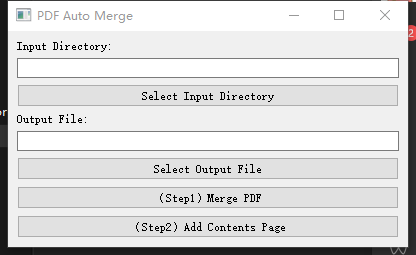
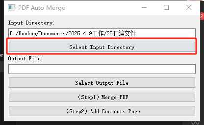
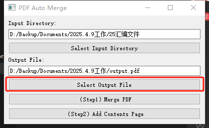
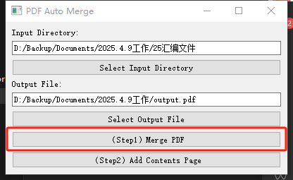
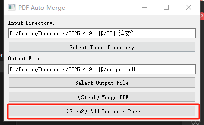

## 运行Running it
```
python main.py
```
## 打包pkg and deploy to .exe
```
pyinstaller --onefile --windowed --add-data "fonts/*;fonts" main.py
```
## 操作说明
### 概览

### 第一步：选中你要合并的文件夹
建议文件夹及其子文件夹中只包含pdf文件

### 第二步：选择你输出的目录及文件名

### 第三步：运行程序开始合并pdf

### 第四步：给合并好的pdf加上目录页


